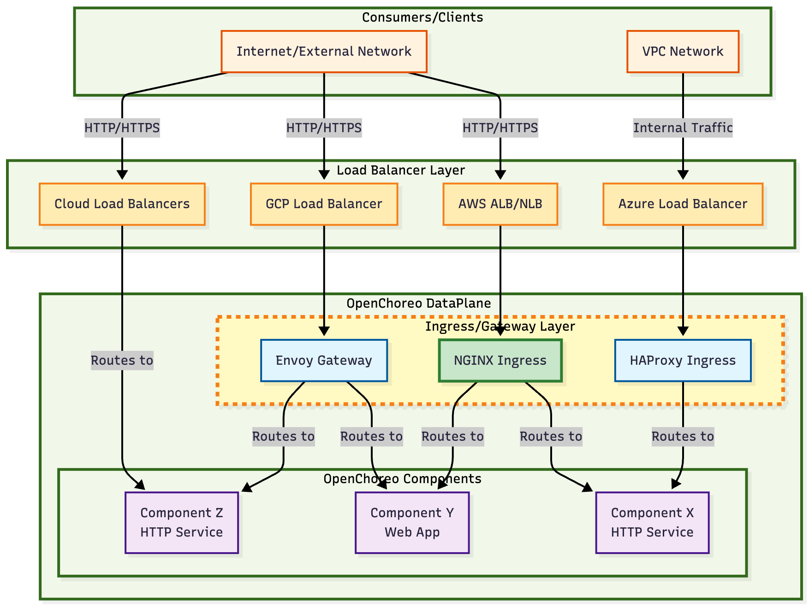

# Title

**Authors**:  
_@your-github-handle_

**Reviewers**:  
_@github-handle (assigned reviewers)_

**Created Date**:  
_YYYY-MM-DD_

**Status**:  
_Submitted / Accepted / Rejected / Implemented_

**Related Issues/PRs**:  
_Linked GitHub issues or pull requests_

---

## Summary

This proposal introduces an extensible Ingress/Gateway controller architecture to expose applications running in OpenChoreo Dataplane to consumers that reside outside the OpenChoreo Dataplane (over the internet or outside the OpenChoreo Dataplane within the same VPC).
OpenChoreo Secure Core automatically exposes OpenChoreo standard component types (HTTP services, Web Apps, etc.) using the default NGINX Ingress controller that is included as a part of OpenChoreo Secure Core.

For other advanced use cases such as TCP routing, advanced HTTP routing like header-based routing, query parameter-based routing, rate limiting, and security policies, proposed solution allows Platform Engineers to utilize the OpenChoreo composable component definition framework to embed their application's networking requirements directly into the Component definition. Furthermore, Platform Engineers can onboard their desired Ingress/Gateway controller and integrate it with OpenChoreo.

---

## Motivation

_Explain the problem this proposal is solving. Why is this feature necessary? What value does it add to OpenChoreo or its users?_

Enterprises use a wide range of Ingress/Gateway controllers, and cloud load balancers to expose their applications running in Kubernetes. Because of this diversity, OpenChoreo cannot impose a rigid, mandatory technology for the Ingress/Gateway layer. Such an approach would force users to abandon their proven tools, creating friction, brittle integrations, technical debt, and vendor lock-in. Therefore, we need a flexible, pluggable architecture for application exposure that allows organizations to leverage their existing investments in technologies and operational expertise.

---

## Goals

_What this proposal aims to achieve._

- **Built-in support for exposing applications:** Provide basic built-in support for exposing OpenChoreo standard components like HTTP services, Web Apps etc.
- **Extensibility:** Enable Platform Engineers to define custom networking requirements through ComponentTypeDefinitions.
- **Vendor agnostic support:** Onboard any Ingress/Gateway controller to OpenChoreo and integrate it using ComponentTypeDefinitions.
- **Portability:** Use standard Ingress/Gateway API features as much as possible without relying on vendor specific extensions to define standard OpenChoreo components to make them portable across different Ingress/Gateway controllers.

---

## Non-Goals

_What this proposal does **not** aim to solve (to set scope clearly)._
API management: Authentication, Authorization, API analytics and monetization etc. are outside the scope of this proposal as they are not required for every application exposure use case.

---

## Impact

_Describe which areas of the OpenChoreo system will be affected (e.g., API Server, Controllers, CLI, SDKs). Include any considerations around backward compatibility, migration, or operational changes._

---

## Design

_Elaborate on the technical design of the feature. This may include component-level architecture, state transitions, interface definitions, configurations, and error handling strategies. Add diagrams or flowcharts as needed to communicate the design clearly._

### Overview

This proposal introduces an extensible architecture for the Ingress/Gateway layer (highlighted in dotted lines) while providing a default option; NGINX Ingress, for exposing basic HTTP services and Web Apps.



The architecture allows Platform Engineers to onboard their preferred Ingress/Gateway controllers, or cloud load balancers into OpenChoreo without being locked into a single technology stack. By leveraging OpenChoreo's composable component definition framework, the solution embeds networking requirements directly into Component definitions, providing a seamless vendor-agnostic approach to integrate the technologies with OpenChoreo abstractions.

### Integration with OpenChoreo abstractions

The networking behavior of applications can be defined directly within the OpenChoreo Component definition itself as follows:

```yaml
apiVersion: openchoreo.dev/v1alpha1
kind: ComponentTypeDefinition
metadata:
  name: web-app
spec:
  # Schema defines what developers can configure
  schema:
    parameters:
      # Static across environments and exposed as inputs to the developer when creating a Component of this type
      runtime:
        command: array<string> | default=[]
        args: array<string> | default=[]
      lifecycle:
        terminationGracePeriodSeconds: integer | default=30
        imagePullPolicy: string | default=IfNotPresent enum="Always,IfNotPresent,Never"

    envOverrides:
      # Can be overriden per environment via EnvironmentSettings by the PE
      resources:
        requests:
          cpu: string | default=100m
          memory: string | default=256Mi
        limits:
          cpu: string | default=500m
          memory: string | default=512Mi
      autoscaling:
        enabled: boolean | default=false
        minReplicas: integer | default=1
        maxReplicas: integer | default=10
        targetCPUUtilization: integer | default=80

  # Templates generate K8s resources dynamically
  resources:
    - id: deployment
      template:
        # ... (standard Deployment YAML)
    - id: service
      template:
        # ... (standard Service YAML)
    # 3. The Ingress resource to expose the Service externally.
    - id: ingress
      template:
        apiVersion: networking.k8s.io/v1
        kind: Ingress
        metadata:
          name: {{ .metadata.name }}
        spec:
          ingressClassName: nginx
          rules:
          - host: {{ .spec.host }}
            http:
              paths:
              - path: /
                pathType: Prefix
                backend:
                  service:
                    name: {{ .metadata.name }}
                    port:
                      number: {{ .workload.endpoints[0].port }}
```

#### OpenChoreo Standard Components with Built-in Networking

For OpenChoreo defined standard components (HTTP services, Web Apps, etc.), the component definitions will contain the required networking configuration to work with the default NGINX Ingress controller. If these definitions use only standard Ingress API features, they remain compatible with any Ingress API compliant controller without modification.

Platform Engineers have the ability to update or override the default networking configuration for existing components using the OpenChoreo composable component definition framework. This allows them to:

- Modify routing rules for specific organizational requirements
- Add vendor-specific annotations or configurations
- Integrate with their preferred Ingress/Gateway controllers
- Embed security policies and advanced traffic management rules

#### Custom Components with Advanced Networking

Platform Engineers can also introduce entirely new component types with their own specialized networking requirements, enabling support for:

- TCP/UDP services beyond HTTP
- Directly exposing applications as Kubernetes LoadBalancer services
- Integration with other Ingress/Gateway API controllers for sophisticated traffic management
- Custom security policies and rate limiting configurations

---

## Appendix (optional)

_Any extra context, links to discussions, references, etc._
